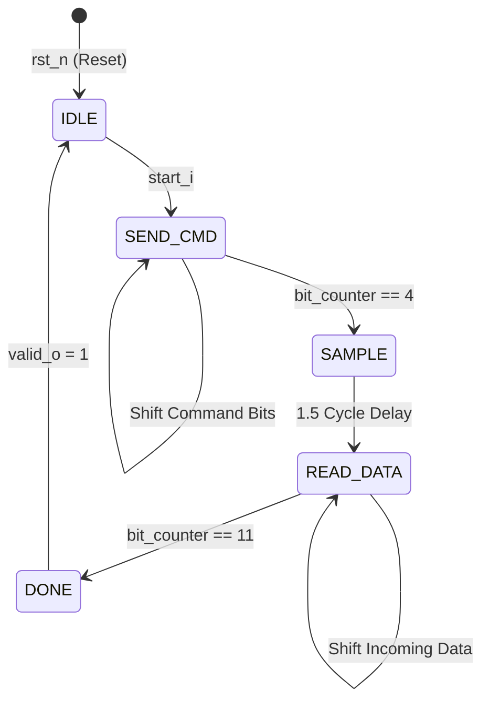
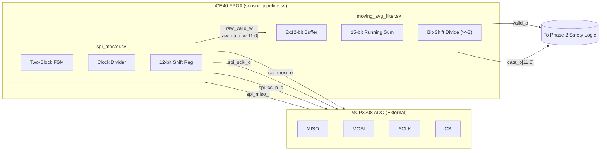
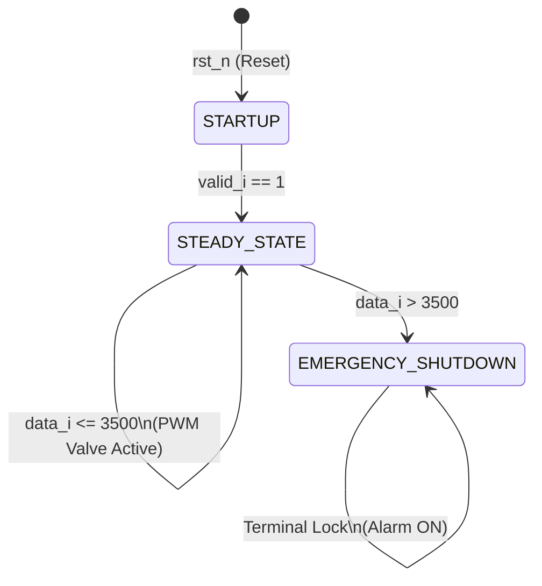

# Phase 1 Progress: SPI Master Implementation

## Overview
I have successfully implemented the first major component of my FADEC Hardware Data Pipeline: The **SPI Master** (`spi_master.sv`). I designed this module to directly interface with an external Analog-to-Digital Converter (like the MCP3208) to retrieve real-time analog telemetry (voltage and current) from my ion thruster and convert it into a digital 12-bit format for my FPGA.

## Architectural Highlights

### 1. Two-Block FSM Design
I built this module adhering to aerospace-grade, deterministic SystemVerilog standards by strictly separating sequential memory from combinational logic:
- **`always_ff`**: Manages my strict clock synchronization, ensuring all memory registers (State, Shift Register, Counters) update simultaneously on the rising edge of the system clock. It also enforces a hardware-level safety reset (`rst_n`) to force my thruster monitoring into an `IDLE` state upon boot.
- **`always_comb`**: Houses my decision logic and the Finite State Machine (FSM), evaluating the next state instantly without clock latency.

**Finite State Machine (FSM) Diagram:**

### 2. Custom Clock Divider
Because my iCE40 FPGA system clock operates significantly faster (e.g., 12+ MHz) than the maximum allowable SPI clock for the ADC (~1-2 MHz), I had to slow it down:
- I implemented a **Clock Divider** (`clk_div_q`) that mathematically down-samples the system clock.
- It generates a slow, stable square wave (`spi_clk_q`) which I route directly to the physical `spi_sclk_o` pin.
- I wrapped the `SEND_CMD` and `READ_DATA` FSM states in synchronization logic (`if (clk_div_q == 4'd5)`) to ensure my bits are only shifted exactly when the slow SPI clock ticks.

### 3. Shift Register Architecture
To handle the serial nature of the SPI protocol over my single `MISO` wire:
- I utilized a 12-bit shift register (`shift_reg_q`).
- During `SEND_CMD`, I shift out the 5-bit command configuration (Start Bit, Single-Ended Mode, and Channel Selection) via concatenation: `{shift_reg_q[10:0], 1'b0}`.
- During `READ_DATA`, I capture incoming serial blips from the ADC and re-assemble them into a parallel 12-bit word: `{shift_reg_q[10:0], spi_miso_i}`.

### 4. Physical Analog Delay (The `SAMPLE` State)
I incorporated a dedicated `SAMPLE` state in my FSM. This acts as a hardware "dummy" cycle to accommodate the physical limitations of the ADC, allowing its internal Sample-and-Hold capacitor the necessary time (1.5 clock cycles) to physically charge and lock the incoming analog voltage before digitization begins.

### 5. The Moving Average Filter (`moving_avg_filter.sv`)
To ensure my FADEC safety logic does not trigger false engine shutdowns due to the extreme electrical noise characteristic of ion thrusters, I implemented a hardware-accelerated **Moving Average Filter**.

- **The Rolling Buffer**: The module maintains an array of eight 12-bit registers (`buffer_q[0:7]`), acting as a short-term memory bank for the last 8 telemetry snapshots from the ADC.
- **The Running Sum**: Rather than looping through the array to recalculate the total on every clock cycle, I implemented a running sum (`sum_q`). When a new reading arrives, the logic simply subtracts the oldest reading (`buffer_q[7]`) and adds the new reading (`data_i`), keeping the sum perfectly accurate.
- **Zero-Latency Division**: Because division logic is highly inefficient in silicon, I sized my array to exactly $2^3$ (8) samples. To calculate the final average, I physically wired the top 12 bits of the 15-bit sum directly to the output pins (`data_o = sum_q[14:3]`). This effectively bit-shifts the sum to the right by 3, perfectly dividing the total by 8 in a single, combinational clock cycle!

## Top-Level Hardware Integration
The pipeline is fully instantiated inside a top-level wrapper (`sensor_pipeline.sv`). This module routes external I/O directly into the internal architecture, seamlessly piping the raw 12-bit telemetry from the SPI Master into the Moving Average Filter without utilizing external registers.

**RTL Block Diagram:**

## Simulation and Verification
To prove the physical logic prior to synthesis, I wrote a comprehensive testbench (`tb_sensor_pipeline.sv`) simulating a 12 MHz FPGA clock environment. Using **EDA Playground** and the **EPWave** visualization tool, I successfully verified:
- The clock divider down-sampling the 12 MHz system clock into a clean, stable SPI clock.
- The `start_i` signal triggering the FSM to immediately pull `spi_cs_n_o` low.
- The dummy 1.5 cycle delay in the `SAMPLE` state successfully shifting into `READ_DATA`.
- The Moving Average Filter correctly dividing the sampled dummy values.

# Phase 2 Progress: Propulsion Control Laws

## Overview
With the telemetry successfully acquired and filtered in Phase 1, I have engineered the central decision-making brain of the FADEC: The **Propulsion Control Laws** (`control_laws.sv`). This module evaluates the clean, 12-bit telemetry stream against hard-coded safety redlines to dynamically control the ion thruster valves and trigger hardware-level emergency shutdowns.

## Architectural Highlights

### 1. The Safety FSM
I designed a 3-state Finite State Machine to govern the engine's lifecycle safely:
- **`STARTUP`**: The default boot state. The FADEC holds all valves closed and waits for the very first valid telemetry reading (`valid_i == 1`) to ensure it does not act on garbage data during power-up.
- **`STEADY_STATE`**: The active flight mode. The module actively compares the incoming telemetry against the critical Redline threshold (`12'd3500`).
- **`EMERGENCY_SHUTDOWN`**: A terminal safety state. If the telemetry exceeds the Redline, the FSM permanently locks into this state, slams the fuel valves shut, and asserts the `alarm_o` pin. The only way to exit this state is a physical hardware reset.

**Control Laws FSM Diagram:**

### 2. Hardware PWM (Pulse Width Modulation) Controller
To proportionally control the analog Xenon gas flow valves using strictly digital (0V or 3.3V) FPGA pins, I engineered a hardware PWM generator.
- **The Heartbeat**: I built an 8-bit counter (`pwm_counter_q`) that increments by 1 on every single tick of the 12 MHz system clock. It continuously counts from 0 to 255 and overflows back to 0.
- **The Duty Cycle**: During `STEADY_STATE`, a combinational comparator constantly evaluates this counter (`if (pwm_counter_q < 8'd128)`). Because 128 is exactly half of 256, this logic asserts the `valve_pwm_o` pin HIGH for exactly 50% of the cycle, and LOW for the other 50%.
- **The Result**: The rapid 12 MHz pulsing provides an exact 50% duty cycle, effectively holding the mechanical valve exactly halfway open.

## Next Steps
Now that both the Sensor Pipeline (Phase 1) and the Control Laws (Phase 2) are complete, the final step is **Top-Level Integration**. I will wire the `control_laws.sv` module inside the `sensor_pipeline.sv` wrapper, connecting the telemetry output of the Moving Average Filter directly into the input of the Control Laws. Finally, I will write a testbench to simulate a catastrophic engine failure and prove the FSM triggers the emergency shutdown.
