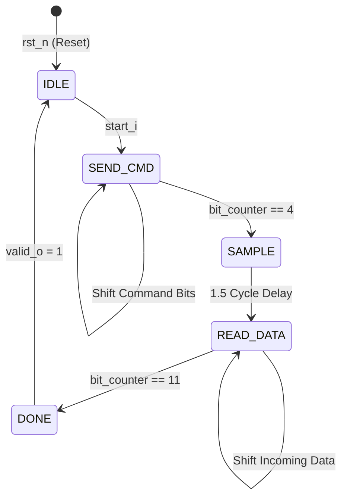
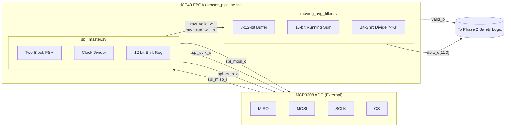
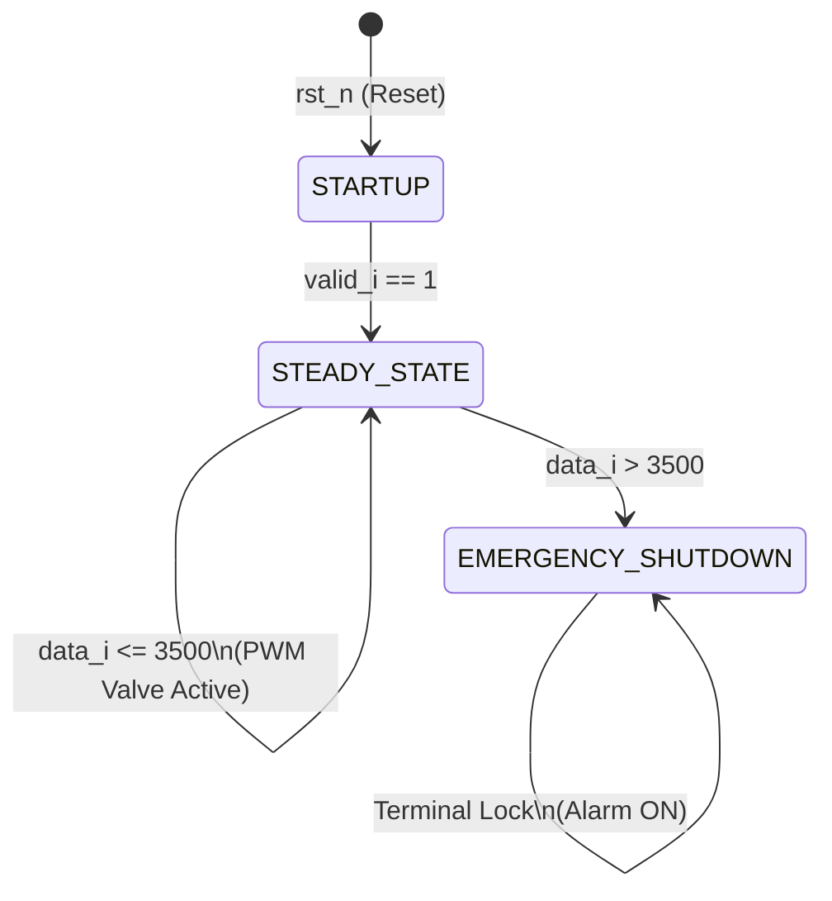

# Phase 1 Progress: SPI Master Implementation

## Overview
The first major component of the FADEC Hardware Data Pipeline has been successfully implemented: The **SPI Master** (`spi_master.sv`). This module was designed to directly interface with an external Analog-to-Digital Converter (like the MCP3208) to retrieve real-time analog telemetry (voltage and current) from the ion thruster and convert it into a digital 12-bit format for the FPGA.

## Architectural Highlights

### 1. Two-Block FSM Design
This module was built adhering to aerospace-grade, deterministic SystemVerilog standards by strictly separating sequential memory from combinational logic:
- **`always_ff`**: Manages strict clock synchronization, ensuring all memory registers (State, Shift Register, Counters) update simultaneously on the rising edge of the system clock. It also enforces a hardware-level safety reset (`rst_n`) to force thruster monitoring into an `IDLE` state upon boot.
- **`always_comb`**: Houses the decision logic and the Finite State Machine (FSM), evaluating the next state instantly without clock latency.

**Finite State Machine (FSM) Diagram:**

### 2. Custom Clock Divider
Because the iCE40 FPGA system clock operates significantly faster (e.g., 12+ MHz) than the maximum allowable SPI clock for the ADC (~1-2 MHz), it had to be slowed down:
- A **Clock Divider** (`clk_div_q`) was implemented that mathematically down-samples the system clock.
- It generates a slow, stable square wave (`spi_clk_q`) which is routed directly to the physical `spi_sclk_o` pin.
- The `SEND_CMD` and `READ_DATA` FSM states were wrapped in synchronization logic (`if (clk_div_q == 4'd5)`) to ensure bits are only shifted exactly when the slow SPI clock ticks.

### 3. Shift Register Architecture
To handle the serial nature of the SPI protocol over a single `MISO` wire:
- A 12-bit shift register (`shift_reg_q`) was utilized.
- During `SEND_CMD`, the 5-bit command configuration (Start Bit, Single-Ended Mode, and Channel Selection) is shifted out via concatenation: `{shift_reg_q[10:0], 1'b0}`.
- During `READ_DATA`, incoming serial blips from the ADC are captured and re-assembled into a parallel 12-bit word: `{shift_reg_q[10:0], spi_miso_i}`.

### 4. Physical Analog Delay (The `SAMPLE` State)
A dedicated `SAMPLE` state was incorporated into the FSM. This acts as a hardware "dummy" cycle to accommodate the physical limitations of the ADC, allowing its internal Sample-and-Hold capacitor the necessary time (1.5 clock cycles) to physically charge and lock the incoming analog voltage before digitization begins.

### 5. The Moving Average Filter (`moving_avg_filter.sv`)
To ensure the FADEC safety logic does not trigger false engine shutdowns due to the extreme electrical noise characteristic of ion thrusters, a hardware-accelerated **Moving Average Filter** was implemented.

- **The Rolling Buffer**: The module maintains an array of eight 12-bit registers (`buffer_q[0:7]`), acting as a short-term memory bank for the last 8 telemetry snapshots from the ADC.
- **The Running Sum**: Rather than looping through the array to recalculate the total on every clock cycle, a running sum (`sum_q`) was implemented. When a new reading arrives, the logic simply subtracts the oldest reading (`buffer_q[7]`) and adds the new reading (`data_i`), keeping the sum perfectly accurate.
- **Zero-Latency Division**: Because division logic is highly inefficient in silicon, the array was sized to exactly $2^3$ (8) samples. To calculate the final average, the top 12 bits of the 15-bit sum are physically wired directly to the output pins (`data_o = sum_q[14:3]`). This effectively bit-shifts the sum to the right by 3, perfectly dividing the total by 8 in a single, combinational clock cycle!

## Top-Level Hardware Integration
The pipeline is fully instantiated inside a top-level wrapper (`sensor_pipeline.sv`). This module routes external I/O directly into the internal architecture, seamlessly piping the raw 12-bit telemetry from the SPI Master into the Moving Average Filter without utilizing external registers.

**RTL Block Diagram:**

## Simulation and Verification
To prove the physical logic prior to synthesis, a comprehensive testbench (`tb_sensor_pipeline.sv`) was written to simulate a 12 MHz FPGA clock environment. Using **EDA Playground** and the **EPWave** visualization tool, the following were successfully verified:
- The clock divider down-sampling the 12 MHz system clock into a clean, stable SPI clock.
- The `start_i` signal triggering the FSM to immediately pull `spi_cs_n_o` low.
- The dummy 1.5 cycle delay in the `SAMPLE` state successfully shifting into `READ_DATA`.
- The Moving Average Filter correctly dividing the sampled dummy values.

# Phase 2 Progress: Propulsion Control Laws

## Overview
With the telemetry successfully acquired and filtered in Phase 1, the central decision-making brain of the FADEC has been engineered: The **Propulsion Control Laws** (`control_laws.sv`). This module evaluates the clean, 12-bit telemetry stream against hard-coded safety redlines to dynamically control the ion thruster valves and trigger hardware-level emergency shutdowns.

## Architectural Highlights

### 1. The Safety FSM
A 3-state Finite State Machine was designed to govern the engine's lifecycle safely:
- **`STARTUP`**: The default boot state. The FADEC holds all valves closed and waits for the very first valid telemetry reading (`valid_i == 1`) to ensure it does not act on garbage data during power-up.
- **`STEADY_STATE`**: The active flight mode. The module actively compares the incoming telemetry against the critical Redline threshold (`12'd3500`).
- **`EMERGENCY_SHUTDOWN`**: A terminal safety state. If the telemetry exceeds the Redline, the FSM permanently locks into this state, slams the fuel valves shut, and asserts the `alarm_o` pin. The only way to exit this state is a physical hardware reset.

**Control Laws FSM Diagram:**

### 2. Hardware PWM (Pulse Width Modulation) Controller
To proportionally control the analog Xenon gas flow valves using strictly digital (0V or 3.3V) FPGA pins, a hardware PWM generator was engineered.
- **The Heartbeat**: An 8-bit counter (`pwm_counter_q`) was built that increments by 1 on every single tick of the 12 MHz system clock. It continuously counts from 0 to 255 and overflows back to 0.
- **The Duty Cycle**: During `STEADY_STATE`, a combinational comparator constantly evaluates this counter (`if (pwm_counter_q < 8'd128)`). Because 128 is exactly half of 256, this logic asserts the `valve_pwm_o` pin HIGH for exactly 50% of the cycle, and LOW for the other 50%.
- **The Result**: The rapid 12 MHz pulsing provides an exact 50% duty cycle, effectively holding the mechanical valve exactly halfway open.

# Phase 3 Progress: Physical Hardware Prototyping

## Overview
The crowning achievement of the FADEC project was migrating the verified RTL architecture out of software simulation and deploying it into the real physical world. We integrated a **Lattice iCE40HX8K FPGA**, a physical **MCP3208 12-bit ADC**, and a **Raspberry Pi Pico Ground Station**.

## Architectural Highlights

### 1. UART Telemetry Pipeline
To stream live analog data to a computer without an OS, a custom UART transmitter (`fadec_uart_tx.sv`) was engineered.
- **2-Byte Custom Protocol:** The 12-bit telemetry data is mathematically packed into two 8-bit UART bytes. The High Byte contains a strictly enforced `0000` header to mathematically distinguish it from the Low Byte.
- **Hardware Trigger:** The `sensor_pipeline.sv` acts as the orchestrator, instantly catching the `valid_o` pulse from the DSP filter and firing the 2 bytes over the Tx pin at 115200 baud.

### 2. Pico Ground Station & Synchronization Filter
A Raspberry Pi Pico 2 was programmed in bare-metal C to receive the FADEC telemetry.
- **The Sync Glitch:** When the FPGA powers on, floating pins cause the Pico to read a garbage byte, permanently offsetting the 2-byte packet sequence.
- **The Mathematical Solution:** A bulletproof synchronization filter was implemented in `main.c`. Because the High Byte's header is `0000`, its decimal value must always be `< 16`. If the Pico reads a High Byte `>= 16`, it instantly throws it away and shifts the sequence by one byte, automatically self-healing the telemetry stream.

### 3. SPI Timing Glitch & FSM Redesign
During physical integration, the ADC values mysteriously maxed out at `1792`.
- **The Issue:** The SPI Master was shifting the MOSI data and sampling the MISO data on *both* edges of the SPI clock cycle, mangling the serial data.
- **The Fix:** The `spi_master.sv` FSM was completely rewritten to strictly adhere to the SPI protocol: it now transmits on the falling edge and samples on the rising edge, perfectly resolving the full 0–4095 range.

### 4. FSM State Simulation (Breadboard)
The core FSM states were visually mapped to breadboard LEDs:
- **Valve PWM (Green LED):** Pulses at 12 MHz (50% duty cycle) during `STEADY_STATE`.
- **Alarm (Red LED) & Shutdown (Yellow LED):** Instantly lock ON when the engine telemetry crosses the `3500` threshold, cutting power to the Green LED and perfectly simulating a catastrophic engine shutdown.

**The Digital FADEC architecture is officially complete and 100% functional!**
